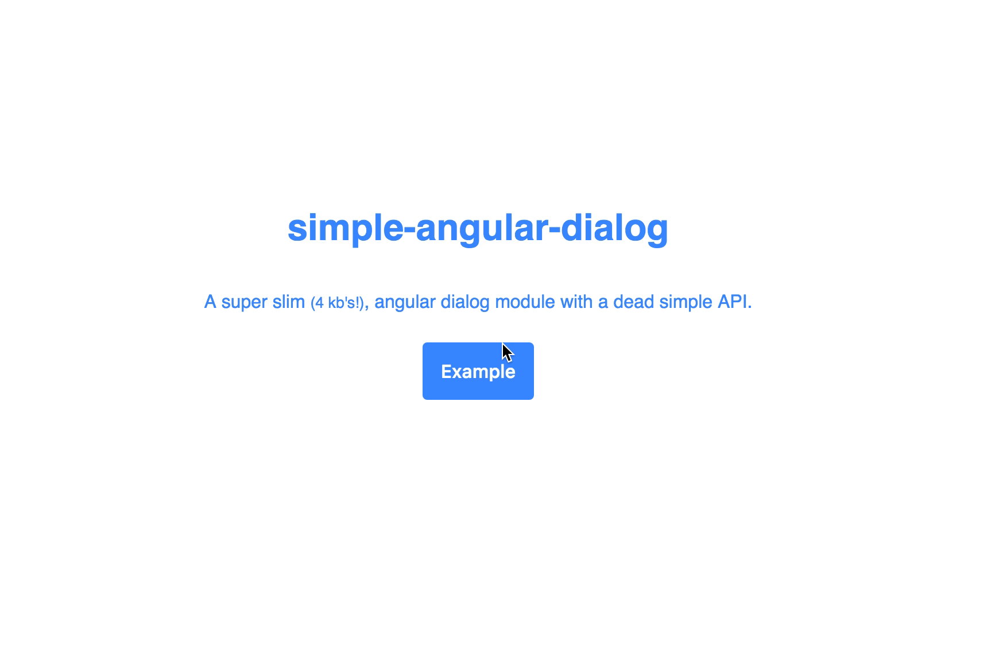

## simple-angular-dialog

[Live Demo!](https://hanford.github.io/simple-angular-dialog)

This is a super easy, small library for creating dynamic dialogs with angularjs. Calling ```dialog.show``` or ```dialog.confirm``` creates a promise, which is either resolved or rejected.

[![NPM][dialog-icon]][dialog-url]

#### Installation  

```
$ npm install simple-angular-dialog --save
```

Add simple-angular-dialog to your dependencies

```
  <link rel="stylesheet" type="text/css" href="dialog.css">
</head>
<body>
  ...
  <script type="text/javascript" src="angular.js"></script>
  <script type="text/javascript" src="simple-angular-dialog.min.js"></script>
</body>


```

Then in your app should look something like this:


```
angular
  .module('YourApp', ['simple-angular-dialog'])
  .controller('ctrl', ['dialog', function (dialog) {

    $scope.value = 123

    $scope.showDialog = function () {
      return dialog.show({
        template: require('./dialog.template.html')
        controler: function (value, dialog, $scope) {
          console.log(value)

          $scope.close = function () {
            return dialog.close()
          }

        },
        locals: {value: $scope.value}
      })
        .then(function (data) {
          console.log('Submit Called', data)
        })
        .catch(function () {
          console.log('Cancel Called')
        })
    }

  })
```

#### Usage / API
```
dialog.show({
  template: require('./dialog.template.html'),
  controller: function () {},
  controllerAs: 'vm',
  escapeKey: false,
  locals: {key: param}
 })

dialog.confirm('Confirm Text')
```  




[dialog-icon]: https://nodei.co/npm/simple-angular-dialog.png?downloads=true
[dialog-url]: https://npmjs.org/package/simple-angular-dialog
